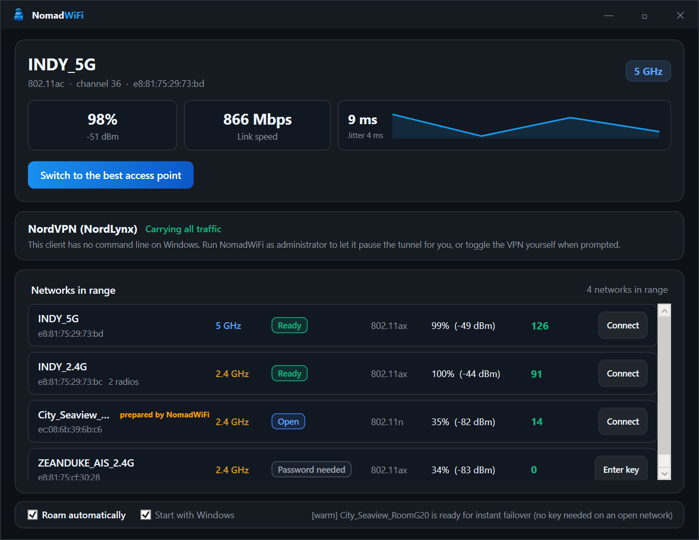

# NomadWiFi

**Wi-Fi roaming and band optimizer for Windows.**
[nomadwifi.mory.dev](https://nomadwifi.mory.dev) · [Documentation](https://nomadwifi.mory.dev/docs)

Windows clings to the first access point it associated with. You walk to the far end of the cafe,
the signal drops to −80 dBm, and it still will not move — while a 5 GHz radio two metres away sits
idle. NomadWiFi measures every access point in range, moves you to the one that is actually good,
recovers in about a second when the link drops, and gets your VPN out of the way while it does it.



## What it does

- **Ranks access points honestly.** The driver reports the AP you are joined to at ~99% link quality
  regardless of its real signal, which is why the incumbent always wins. NomadWiFi scores every
  radio from measured RSSI, band, 802.11 standard and BSS-Load airtime congestion.
- **Recovers when the link drops.** It subscribes to the wireless service's ACM notifications rather
  than polling, so a disconnect is noticed in ~100 ms with the candidate ladder already built. A
  roam that fails to carry traffic is rolled back.
- **Prepares the venue in advance.** Hotels publish one key across `Lobby`, `_5G` and `Floor2`.
  NomadWiFi recognises the family, writes the profiles before they are needed (per-user, so no
  elevation), verifies them on first association, and deletes guesses that fail twice.
- **Cooperates with your VPN.** Hold the tunnel → switch → verify → resume → flush DNS. The
  off-and-on-again dance, automated. See [the VPN page](https://nomadwifi.mory.dev/docs/vpn).
- **Understands captive portals.** A sign-in page cannot load through a tunnel; NomadWiFi says so and
  offers one click to pause, sign in and resume. A portal is never mistaken for a bad access point.

## Install

**[Download the installer](https://github.com/mory-dev/nomadwifi/releases/latest/download/NomadWiFi-Setup.exe)**
— or, if you prefer a package manager:

```powershell
winget install mory-dev.NomadWiFi     # desktop app and CLI
scoop install nomadwifi               # CLI only
```

The installer is per-user: it goes to `%LOCALAPPDATA%\Programs\NomadWiFi` and **never prompts for
administrator rights**, on install or on update. It adds a Start Menu entry, an Add/Remove Programs
entry, and optionally puts `nomadwifi` on your `PATH`. Uninstalling removes all of it and asks
before touching the networks NomadWiFi learned.

NomadWiFi tells you when a new version is out and installs it on one click. `nomadwifi update`
does the same from a terminal.

For the CLI on its own, built from source:

```
go install github.com/mory-dev/nomadwifi/cmd/nomadwifi@latest
```

Note that a `go install` build is **not code-signed** — the released binaries are.

<details>
<summary>Installed layout, and why both executables share a name</summary>

```
%LOCALAPPDATA%\Programs\NomadWiFi\
  nomadwifi.exe          # the desktop app
  core\nomadwifi.exe     # the engine it drives, and the CLI (same binary)
```

Both are called `nomadwifi.exe` deliberately: the app should not be named something else in the
taskbar just because a CLI shares the project. They live in separate folders because of it, and the
app resolves its engine only from `core\`, refusing any candidate that resolves to itself. Earlier
versions also searched `PATH`, which let a stale copy be run silently — that fallback is gone.

</details>

Administrator rights are not required for anything the app does. The only action that asks for
elevation is pausing a VPN client that has no command line of its own.

### Requirements

Windows 10 version 1903 or later, 64-bit. The desktop app needs .NET Framework 4.8, which ships
with those versions; the installer checks for it and links the download if it is missing. The CLI
needs nothing.

## Use it

```
nomadwifi                     # interactive terminal menu
nomadwifi status              # link stats, gateway latency, captive portal, VPN
nomadwifi scan [--all]        # rank nearby networks; --all lists every radio
nomadwifi optimize            # switch to the best AP, rolling back if it fails
nomadwifi connect <SSID>      # optionally with --password <key>
nomadwifi watch [--interval N]  # monitor continuously and roam automatically
nomadwifi vpn [status|hold|resume]
nomadwifi warm                # prepare profiles for instant failover
nomadwifi update [--install]  # check for a newer release, and apply it
nomadwifi logs
nomadwifi version
```

Every command accepts `--json`. `--dry-run`, `--no-vpn`, `--password` and `--interval` are
documented in the [CLI reference](https://nomadwifi.mory.dev/docs/cli).

```console
$ nomadwifi scan --json | jq '.[0] | {ssid, band, rssi, quality_score, reasons}'
{
  "ssid": "INDY_5G",
  "band": "5 GHz",
  "rssi": -43,
  "quality_score": 126,
  "reasons": ["Wi-Fi 6 (802.11ax)", "5 GHz band", "AP airtime nearly idle", "Saved network"]
}
```

## Build

Requires Go 1.21+ and, for the desktop app, MSBuild with .NET Framework 4.8.

```powershell
.\build.ps1              # icons, tests, both binaries, dist\ layout
.\build.ps1 -SkipGui     # command line only
.\build.ps1 -Zip         # also produce release archives
.\build.ps1 -Installer   # also produce the installer (needs Inno Setup 6)
```

Output lands in `dist\`. `go build ./cmd/nomadwifi` alone works too — the icon and manifest come
from the committed `resource_windows.syso`, so no extra tooling is needed.

The version comes from the `VERSION` file and nowhere else: `build.ps1` stamps it into
`versioninfo.json`, `AssemblyInfo.cs` and both side-by-side manifests on every build, so those
cannot drift. Pass `-Version` to override it, as the release workflow does with the pushed tag.

```
go vet ./... && go test ./...
```

## Layout

| Path | What lives there |
| --- | --- |
| `cmd/nomadwifi` | CLI entry point, interactive menu, and the `agent --stdio` JSON protocol |
| `pkg/wifi` | Native Wifi API bindings, scanning, the rolling BSSID cache, profiles, warming |
| `pkg/roam` | Health model and the roaming engine: ladder, switch, verify, rollback |
| `pkg/vpn` | Tunnel detection, per-client control, hold/resume/repair |
| `pkg/state` | `~/.nomadwifi/state.json` — provisioned profiles, verification, penalty box |
| `pkg/tui` | Terminal rendering |
| `tools/NomadWiFi.UI` | The WPF desktop app |
| `tools/genicon` | Pure-Go ICO generator for the app icon |
| `packaging` | Inno Setup script, plus the winget and Scoop manifests |
| `site` | The documentation site published at nomadwifi.mory.dev |

## Where it keeps things

| Path | Contents |
| --- | --- |
| `%USERPROFILE%\.nomadwifi\state.json` | Profiles NomadWiFi created, verification, failures, penalties |
| `%USERPROFILE%\.nomadwifi\scan-cache.json` | Rolling view of access points, so one-shot commands see the whole venue |

Delete either to start fresh; both are rebuilt automatically.

## Scope

Windows 10 and 11 only. NomadWiFi does not patch drivers, install a service, or run anything
elevated. The only registry value it writes is the single `Run` entry for start-with-Windows.

Every released binary and the installer are Authenticode-signed via Azure Artifact Signing
(`CN=Bizonbyte`) with RFC3161 timestamps, and the release pipeline fails if any of them does not
verify. A brand-new signing identity still has no SmartScreen reputation, so you may see a warning
until enough people have installed it.

## License

MIT.
